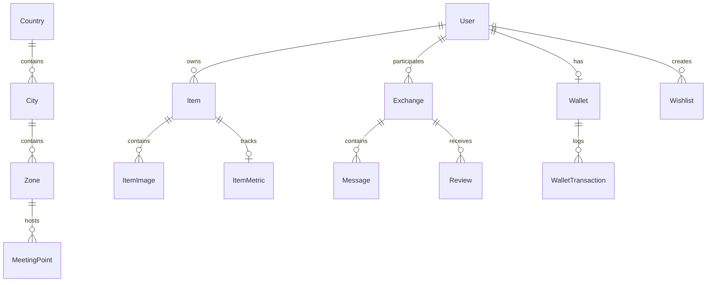

# 📚 Swaply — Documentation Technique & Fonctionnelle Complète

> **Version :** 2.0.0  
> **Dernière mise à jour :** 2026-08-18  
> **Statut :** Production-Ready / Stable

---

## 🌟 1. Vision & Proposition de Valeur

**Swaply** est une plateforme internationale de troc et d'économie circulaire dématérialisée peer-to-peer (P2P). Elle permet aux particuliers d'échanger des biens physiques sans transaction financière directe entre utilisateurs, grâce à une monnaie virtuelle interne standardisée appelée **"Swaps"**.

### Piliers Fondamentaux :
1. **Élimination de la double coïncidence des désirs :** L'utilisateur A peut acquérir l'objet de B sans que B n'ait besoin d'un objet spécifique de A. B reçoit des Swaps qu'il peut dépenser avec C ou D.
2. **Confiance & Sécurité Physique (Escrow QR Code) :** Les crédits sont séquestrés lors de la réservation et transférés uniquement lors de la remise physique en main propre via un handshake chiffré par QR code.
3. **Intelligence Artificielle & Marché Réel :** Évaluation automatique des objets basée sur la marque, l'usure, la catégorie et les transactions réelles passées dans la même ville/pays.
4. **Ancrage Local & Expansion Mondiale :** Découverte par micro-zones géographiques avec prise en charge des moyens de paiement mobiles locaux (Flooz, TMoney) et internationaux (Stripe, PayPal).

---

## 🏗️ 2. Stack Technique & Architecture

| Couche | Technologie | Rôle |
| :--- | :--- | :--- |
| **Framework Full-Stack** | Next.js 16.1.6 (App Router + Turbopack) | Rendu hybride SSR / RSC / Server Actions / API Routes |
| **Runtime & UI** | React 19.2.3 + TypeScript 5 | Composants réactifs, typage strict et hooks modernes |
| **Styling & Design System** | Tailwind CSS v4 + Framer Motion 12 | Tokens CSS HSL, Glassmorphism, animations physiques et thèmes |
| **Base de Données & ORM** | PostgreSQL + Prisma ORM v7.4.2 | Schéma relationnel, transactions ACID et migrations |
| **Authentification & Session** | Supabase Auth (`@supabase/ssr`) | Gestion des tokens JWT, cookies sécurisés et session |
| **Temps Réel** | Supabase Realtime | Messagerie instantanée et événements live |
| **Stockage Fichiers** | UploadThing | Upload et optimisation CDN des photos d'annonces |
| **Cache & Rate Limiting** | Upstash Redis (`@upstash/ratelimit`) | Cache distribué pour la découverte et limitation de requêtes |
| **Internationalisation** | Next-Intl (FR, EN, ES, PT) | Routage dynamique localisé (`/[locale]/...`) |
| **Tests & Qualité** | Vitest + Testing Library | Tests unitaires automatisés pour l'économie et la logique métier |

---

## 🗄️ 3. Schéma de Données (Prisma)

### Modèles Principaux :


### Détail des Entités Clés :
- **`User`** : Profil utilisateur, réputation (`trustScore`), gamification (`xp`, `level`), coordonnées GPS et appartenance géographique (`countryId`, `cityId`, `zoneId`).
- **`Wallet` & `WalletTransaction`** : Double solde (`balanceSwaps` achetés/gagnés et `promoSwaps` promotionnels non transférables).
- **`Item` & `ItemImage`** : Annonces d'objets avec métadonnées (`category`, `brand`, `conditionLabel`, `priceSwaps`, `aiSuggestedSwaps`, `aiConfidence`, `status`).
- **`Exchange`** : Cycle de vie d'un échange (`PENDING`, `CONFIRMED`, `COMPLETED`, `CANCELLED`, `EXPIRED`, `DISPUTED`), séquestre des Swaps (`requesterSwaps`), token QR chiffré (`qrToken`) et délai d'expiration (`reservedUntil`).
- **`Wishlist` & `WishlistMatch`** : Système SwapMatch reliant automatiquement les souhaits des utilisateurs aux nouvelles annonces publiées dans leur zone.
- **`MeetingPoint`** : Points de rencontre publics et sécurisés configurés par ville/zone.
- **`PaymentProvider`, `TopupPackage`, `PaymentTransaction`** : Recharges de Swaps multi-devises (FCFA, EUR, USD) et passerelles de paiement.

---

## 💎 4. Moteur Économique Swaps & Escrow

### 1. Dualité des Soldes :
- **`balanceSwaps`** : Swaps acquis par vente d'objets ou recharge financière.
- **`promoSwaps`** : Swaps offerts (bonus d'inscription de 60 Swaps, bonus 1ère publication).
- **Priorité de déduction** : Lors d'une dépense, les `promoSwaps` sont consommés en premier pour protéger le capital réel de l'utilisateur.

### 2. Séquestre & Flux de Réservation :
```
[Demandeur réserve l'objet (100 Swaps)]
         │
         ▼
[Vérification du solde : Solde >= 100 ?]
         │
         ├── Oui ──► [Débit immédiat du demandeur -> Séquestre dans l'Exchange]
         │          [Item passe en statut RESERVED]
         │          [Notification au propriétaire]
         │
         └── Non ──► [Affichage FeedbackSheet "Solde insuffisant" avec CTA Recharge]
```

### 3. Résolution de l'Échange :
- **Confirmation par scan QR Code** : Les Swaps séquestrés sont transférés au propriétaire (moins une commission plateforme minime de 2%). L'objet devient `EXCHANGED`.
- **Annulation manuelle** : Remboursement intégral et instantané du demandeur. L'objet redevient `AVAILABLE`.
- **Expiration (Cron 24h)** : Remboursement automatique dans la transaction du cron.

---

## 🧠 5. Moteur d'Estimation IA (`src/lib/ai-engine.ts`)

L'algorithme Swaply calcule la valeur recommandée en combinant deux approches :
1. **Modèle Heuristique Multicritères :**
   $$\text{Valeur} = \text{Base}_{\text{Catégorie}} \times K_{\text{Marque}} \times K_{\text{État}} \times K_{\text{Rareté}} \times K_{\text{Âge}} \times K_{\text{Accessoires}}$$
2. **Ancre de Marché Réel (Statistical Market Anchor) :**
   - Requête sur les annonces actives et les échanges complétés dans la même ville/pays pour la catégorie/marque.
   - Calcul de la **médiane** et des **percentiles P20 (min) / P80 (max)**.
   - Pondération dynamique entre l'estimation heuristique et l'ancre de marché réelle (influence de 28% à 68% selon le nombre d'échantillons).

---

## 🔒 6. Sécurité & Protection des Données

- **Validation des Entrées** : Schémas Zod stricts sur toutes les Server Actions (`PublishItemSchema`, `ReserveItemSchema`, `ConfirmExchangeSchema`, `TopUpSchema`).
- **Rate Limiting Distribué** : Sliding Window avec Upstash Redis sur les actions sensibles (réservation, publication, messages, signalements).
- **Row-Level Security (RLS) & Auth Checks** : Vérification systématique de l'identité de l'utilisateur via Supabase Auth avant toute mutation.
- **Transactions ACID** : Utilisation de `prisma.$transaction()` pour toutes les opérations financières et changements d'état d'échange.

---

## 🗺️ 7. Routage & Structure des Dossiers

```
src/
├── app/
│   ├── [locale]/           # Pages localisées (FR, EN, ES, PT)
│   │   ├── page.tsx        # Accueil (Explorer & Feed)
│   │   ├── discover/       # Mode Swipe & Découverte
│   │   ├── item/[id]/      # Fiche détaillée objet
│   │   ├── exchange/[id]/  # Salle de troc & Validation QR
│   │   ├── publish/        # Studio de publication
│   │   ├── messages/       # Liste des échanges actifs
│   │   ├── profile/        # Profil, Portefeuille, Succès
│   │   └── onboarding/     # Parcours d'accueil utilisateur
│   ├── actions/            # Server Actions isolées (item, exchange, wallet, message)
│   └── api/                # Endpoints (cron, geo, search, uploadthing, webhooks)
├── components/             # Composants d'interface réutilisables
├── lib/                    # Utilitaires (auth, ai-engine, swaps, redis, prisma, geo)
└── messages/               # Fichiers de traduction i18n JSON
```

---

## 🚀 8. Commandes Utiles

```bash
# Lancer le serveur de développement
npm run dev

# Générer le client Prisma & build production
npm run build

# Exécuter les tests unitaires
npm test -- --run

# Exécuter le script de backfill des templates de notification
npm run backfill:notifications
```
